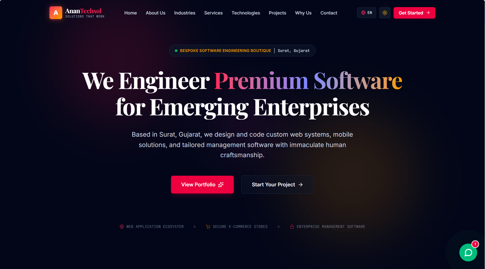

# anantechsol-portfolio

This contains everything you need to run your app locally.

View your app in AI Studio: https://ai.studio/apps/4699ac41-bd21-490a-9c7f-d0d99094954d

## Run Locally

**Prerequisites:**  Node.js

1. Install dependencies:
   `npm install`
2. Set the `GEMINI_API_KEY` in [.env.local](.env.local) to your Gemini API key
3. Run the app:
   `npm run dev`
